```mermaid
sequenceDiagram
    box rgb(200, 227, 255) â€¼ï¸ ğŸ‘‹ğŸ½ğŸ‘‹ğŸ» Developers 👋ğŸ¿ğŸ‘‹ğŸ¾ ‼ï¸
        participant CS as Custom Software
    end

    box rgb(226, 235, 243) AI Service running in Azure AI Foundry
        participant API as API Gateway
        participant CF as Checks and Filters
        participant LLM as Large Language Model
    end

    Note over CS: Prompt derived from<br/>Prompt Template
    CS->>API: Prompt (text, media) + <br/>System Prompt(s) + <br/>context (API key, model, token budget) + <br/>Temperature, Top-p
    API->>CF: Prompt
    Note over API: ✅⌠API key check
    Note over API: ✅⌠API requests-per-minute (RPM) check (429)
    CF->>LLM: Prompt
    Note over CF: ✅⌠Prompt safety check
    Note over CF: ✅⌠Tokens-per-minute (TPM) check (429)
    Note over CF: ✅⌠Prompt vs. context window size check
    Note over CF: $$ Request token accounting
    %% $£€₹¥₽
    Note over LLM: Tokenize, Vectorize as needed
    Note over LLM: Your chosen LLM model <br/>∑ generates next token ğŸ”<br/>applying Temperature & Top-p values
    LLM->>CF: Response(s)
    Note over CF: ✅⌠Response safety check
    Note over CF: $$ Response token accounting
    CF->>API: Response(s)
    API->>CS: Response(s) (text, media) + <br/>context (e.g., token usage)

    %% original: https://github.com/crankingai/azureaitraining/ai-basic-hosting-model.md
```

# Illustrating _The Prompt's Journey_ to and from the LLM

Scenario is an LLM hosted by Microsoft Azure AI Foundry and accessible via API, but conceptually same as OpenAI and other big AI hosts. Demonstrate high-level logical flow of the Prompt through all of its adventures to highlight some key concepts.

For quota management at the API call level, the [documentation for Azure Open AI](https://learn.microsoft.com/en-us/azure/ai-services/openai/how-to/quota?tabs=rest#understanding-rate-limits:~:text=As%20each%20request,the%20counter%20resets.) states:

_As each request is received, Azure OpenAI computes an estimated max processed-token count that includes the following:_

* _Prompt text and count_
* _The max_tokens parameter setting_
* _The best_of parameter setting_

_As requests come into the deployment endpoint, the estimated max-processed-token count is added to a running token count of all requests that is reset each minute. If at any time during that minute, the TPM rate limit value is reached, then further requests will receive a 429 response code until the counter resets._

And has this note related the accounting:

