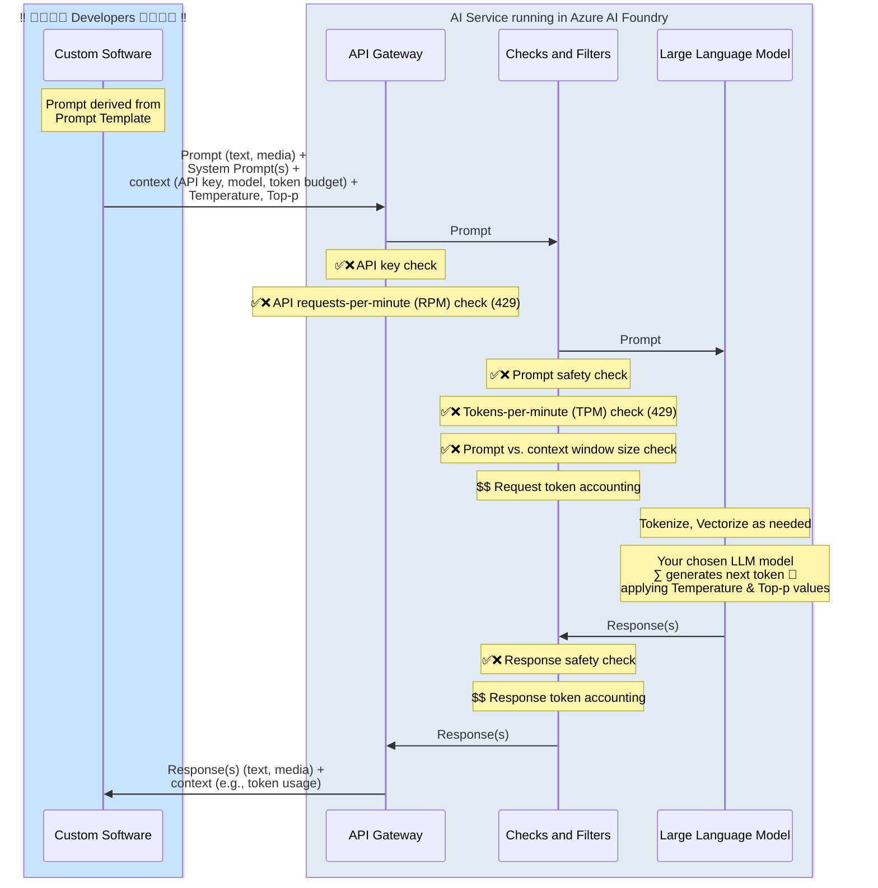

# Basic Hosted AI Service Interaction Model

Demonstrate high-level logical flow to highlight some key concepts.

```mermaid
sequenceDiagram
    box rgb(200, 227, 255) ‼️ 👋🏽👋🏻 Developers 👋🏿👋🏾 ‼️
        participant CS as Custom Software
    end

    box rgb(226, 235, 243) AI Service running in Azure AI Foundry
        participant API as API Gateway
        participant CF as Checks and Filters
        participant LLM as Large Language Model
    end

    Note over CS: Prompt derived from<br/>Prompt Template
    CS->>API: Prompt (text, media) + <br/>System Prompt(s) + <br/>context (API key, model, token budget) + <br/>Temperature, Top-p
    API->>CF: Prompt
    Note over API: ✅❌ API key check
    Note over API: ✅❌ API requests-per-minute (RPM) check (429)
    CF->>LLM: Prompt
    Note over CF: ✅❌ Prompt safety check
    Note over CF: ✅❌ Tokens-per-minute (TPM) check (429)
    Note over CF: ✅❌ Prompt vs. context window size check
    Note over CF: $$ Request token accounting
    %% $£€₹¥₽
    Note over LLM: Tokenize, Vectorize as needed
    Note over LLM: Your chosen LLM model <br/>∑ generates next token 🔁<br/>applying Temperature & Top-p values
    LLM->>CF: Response(s)
    Note over CF: ✅❌ Response safety check
    Note over CF: $$ Response token accounting
    CF->>API: Response(s)
    API->>CS: Response(s) (text, media) + <br/>context (e.g., token usage)

    %% original: https://github.com/crankingai/azureaitraining/ai-basic-hosting-model.md
```
