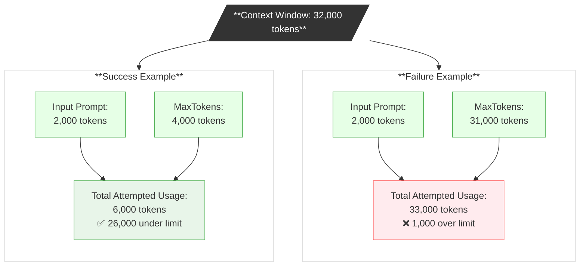

# Prompt + Response <= Context Window

LLMs have assorted limitations on how much data they can process in one shot. One such limitation is known as the _context window_
which is the overall number of tokens available for a single inference request.

The number of tokens consumed by the prompt is implied - you don't specify it separately, 
but rather you send in the prompt and that prompt is innately made up of a certain number of tokens.

You get to specify a cap on the number of tokens consumed in the response - this is MaxTokens, a value typically
transmitted alongside the prompt, temperature, and other response-impacting values.
The response is not going to be exactly this number of tokens, but will not exceed it.

The context window is also measured in tokens. The number of tokens used by the prompt PLUS 
the number of tokens used by the response CANNOT EXCEED
the number of tokens allowed in the context window.

## Consequences

Chat history: unmanaged accumulated chat history can consume a lot of your context window, eventually overflowing it. There are patterns for compressing this.

Cost: if you are paying by the token, token use and spend are correlated.

Latency: does an LLM take longer to process a larger context window?

Accuracy: does a larger context window equally account for all of its content?

## Examples: Context Window = 32,000 tokens

