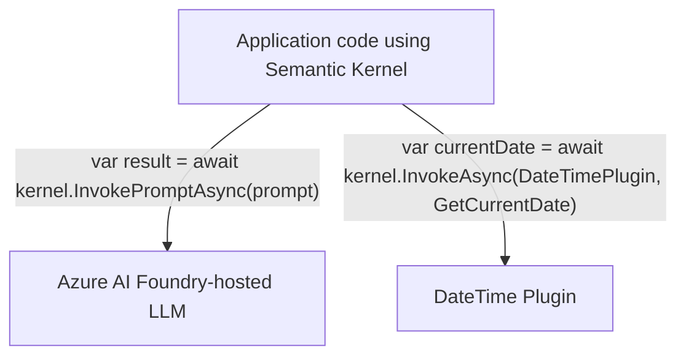
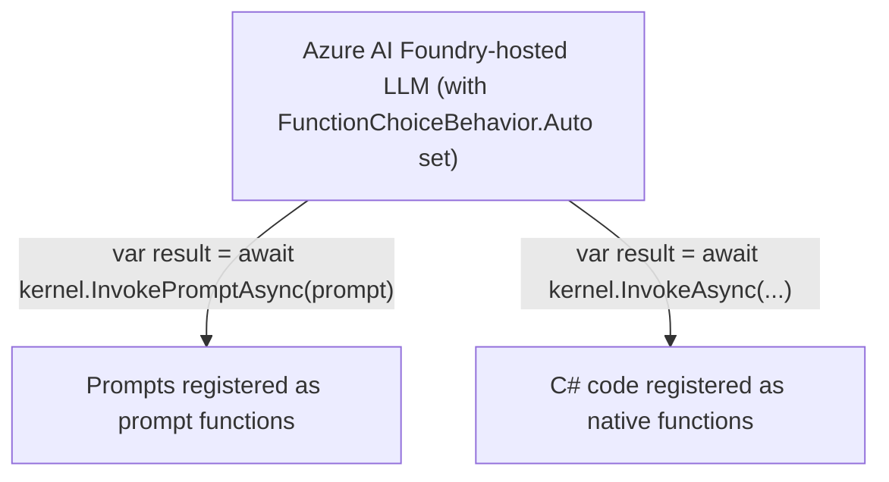

# AI interacts with Prompts and Functions

A Prompt is a function of sorts in that it is a unit of execution. Sometimes also called a "sematic function" but 
more commonly a "prompt function" as a more up-to-date term. In contrast to a Prompt Function there is also a concept
of a Native Function which is a call to arbitrary code, usually to perform an action not available in a pure prompt. 
For example, a native function would be right tool to get the current time, check if a URL resolves, to make an appointment, 
or search company inventory database.

## Application code invoking Semantic Kernel to run a prompt function and a native function

Arrows indicate direction of control flow. Here, our code is calling the LLM, passing it a prompt.



```CSharp
var response = await kernel.InvokePromptAsync("tell me a joke");
var currentDate = await kernel.InvokeAsync<string>("DateTimePlugin", "GetCurrentDate");
```

response = await kernel.InvokePromptAsync( How long until Christmas? Explain you thinking.", 
new(settings));

## Inverted control: Semantic Kernel deciding which functions to call

Arrows indicate direction of control flow. Here is the LLM calling our code!


```CSharp
// register X
public class UrlUtils
{
    [KernelFunction]
    [Description("Returns true if the URL resolves and is of the right format")]
    public string CheckUrl(string url)
    { var httpClient = new HttpClient(...) }
}
builder.Plugins.AddFromType<UrlUtils>();
builder.Plugins.AddFromPromptDirectory("./prompts")

OpenAIPromptExecutionSettings settings = new ()
{
   FunctionChoiceBehavior = FunctionChoiceBehavior.Auto()
}
var response = await kernel.InvokePromptAsync("Draft HTML page using at least one image on topic X", settings);
// behind the scenes the LLM decides which functions to call, and calls them, to solve problem described in prompt
```

## Each Function Might Choose a Different LLM

Big deal! Maybe I have a _native function_ that counts customers in photo. Maybe that uses a diffent model hosted by Google that's really good at that.

Prompty and Semantic Kernel file-based prompts storage formats supports specifying the LLM.
