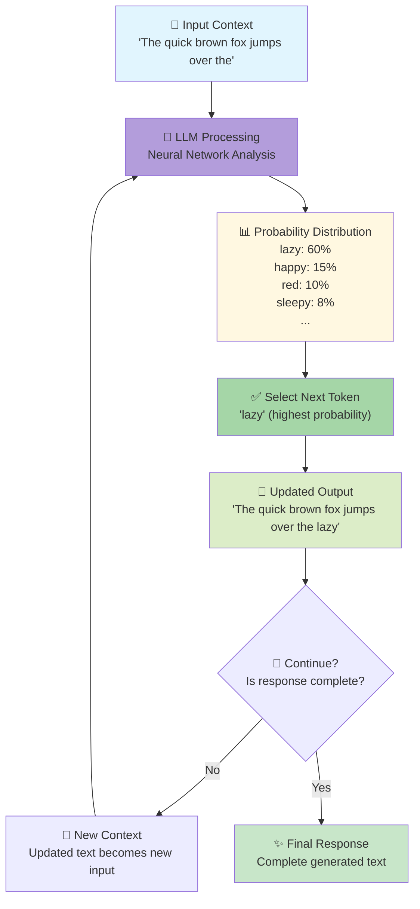

```mermaid
graph TD
    A["📝 Input Context<br/>'The quick brown fox jumps over the'"] --> B["🧠 LLM Processing<br/>Neural Network Analysis"]
    B --> C["📊 Probability Distribution<br/>lazy: 60%<br/>happy: 15%<br/>red: 10%<br/>sleepy: 8%<br/>..."]
    C --> D["✅ Select Next Token<br/>'lazy' (highest probability)"]
    D --> E["📄 Updated Output<br/>'The quick brown fox jumps over the lazy'"]
    E --> F{"🔄 Continue?<br/>Is response complete?"}
    F -->|No| G["📝 New Context<br/>Updated text becomes new input"]
    G --> B
    F -->|Yes| H["✨ Final Response<br/>Complete generated text"]
    
    style A fill:#e1f5fe
    style B fill:#b39ddb
    style C fill:#fff8e1
    style D fill:#a5d6a7
    style E fill:#dcedc8
    style H fill:#c8e6c9
```
