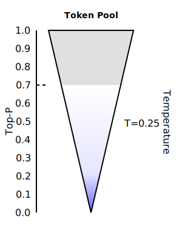

# Top-P and Temperature

| | T=0.25 | T=0.70 |
|----------|----------|----------|
| Top-P=0.7  |  |  |
|  |  |  |

Token	Probability
"hello"	0.4
"hi"	0.3
"hey"	0.2
"greetings"	0.05
"salutations"	0.05
Top-P = 0.9: The model selects from {"hello", "hi", "hey"} because their cumulative probability exceeds 90%.
Top-P = 1.0: The model selects from all tokens (maximum randomness).
Top-P = 0.0: The model always picks only the highest-probability token ("hello"), making it fully deterministic.
