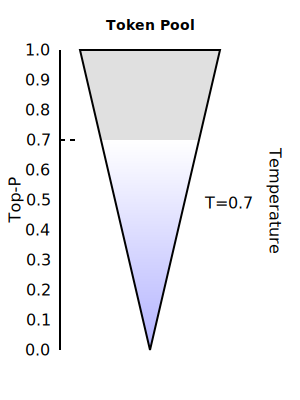

## Top-P and Temperature

Top-P and Temperature influence the probabilities of various response/completion/inference outcomes from LLM.

## Combined Impact - First Top-P, then Temperature

| | T=0.25  ______________________________ | Candidate Words | T=0.70  ______________________________ |
|----------|----------|----------|----------|
| Top-P=0.7  |  | "hello" "hi" |   |
| Top-P=0.9  | | "hello" "hi" "hey" |  |
| Top-P=0.95  | | "hello" "hi" "hey" ("greetings") ("salutations") |  | 
| Top-P=1.00  | | "hello" "hi" "hey" "greetings" "salutations" "whazzup" |  | 

## Word (Token) Probability

| Token        | Probability |
|-------------|------------|
| "hello"     | 0.4        |
| "hi"        | 0.3        |
| "hey"       | 0.2        |
| "greetings" | 0.05       |
| "salutations" | 0.05     |
| "whazzup"   | 0.01       |

* Top-P = 1.0: The model selects from all tokens (maximum selection), influenced by Temperature.
* Top-P = 0.9: The model selects from {"hello", "hi", "hey"} because their cumulative is 0.90%.
* Top-P = 0.0: The model always picks only the highest-probability token ("hello"), theoretically making it deterministic.

## Example Default Values for Top-P and Temperature

| Model | Temperature | Top-P |
|--------|-------------|--------|
| GPT-4 & GPT-3.5 | 1.0 | 1.0 |
| Claude | 1.0 | 1.0 |
| PaLM & Gemini | 0.7 | 0.95 |
| Llama 2 | 0.7 | 0.9 |
| Mistral | 0.7 | 1.0 |

